# Sitio de Blog para Desarrolladores

# Descripción de la aplicación  

* Esta aplicación consiste en un blog para desarrolladores en el que se pueden hacer múltiples publicaciones y comentarios acerca de temas de programación.
* La aplicación posee cuatro enlances correspondientes a "Home", "Dashboard", "Login" y "Logout".
* La aplicación permite acceder a la sección de "Home" aunque el usuario no haya iniciado sesión, lo cual permite únicamente visualizar todas las publicaciones creadas por todos los usuarios, así como su fecha de creación, el usuario que creó la publicación y los comentarios de cada publicación.
* Si el usuario quiere acceder al "Dashboard" o crear comentarios y/o crear, modificar y/o eliminar publicaciones, entonces la aplicación le pedirá registrarse o iniciar sesión:
  * Cuando el usuario elige registrarse e introduce la información, la aplicación guarda sus credenciales y se permite la conexión al sitio.
  * Cuando el usuario elige iniciar sesión e introduce su información, la aplicación valida las credenciales y concede la conexión al sitio.
* Al registrarse o iniciar sesión exitosamente:
  * Cuando el usuario accede a la sección de "Home" puede:
    * Visualizar todas las publicaciones creadas por todos los usuarios, incluyendo su título, contenido, fecha de creación y el usuario que la creó.
    * Dar clic sobre cualquier publicación para:
      * Visualizar los comentarios que se han creado para cada publicación.
      * Crear un comentario para la publicación sobre la que dio clic:
        * Cuando se ingresa el comentario y se da "Submit", entonces el comentario se guarda y aparece debajo de la publicación seleccionada, incluyendo el usuario que creó el comentario y la fecha de creación.
  * Cuando el usuario accede a la sección de "Dasboard" puede:
    * Visualizar todas las publicaciones creadas por el usuario que está conectado, incluyendo la fecha de creación.
    * Crear una nueva publicación:
      * Cuando se ingresa el título, el contenido y se da "Create", entonces la nueva publicación se guarda y aparece en el "Dashboard" actualizado, incluyendo la fecha de creación.
    * Dar clic sobre cualquiera de sus publicaciones para:
      * Actualizar el título y/o contenido de la publicación seleccionada:
        * El usuario puede modificar el título y/o contenido de la publicación y dar clic en "Update". Esto hará que se regrese al "Dashboard" ya con la información actualizada de la publicación modificada.
      * Eliminar la publicación seleccionada presionando el botón "Delete". Esto provocará que se regrese al "Dashboard" donde ya no aparecerá la publicación eliminada.
* La aplicación permite cerra la sesión desde el enlace "Logout".
* La sesión del usuario expira después de 4 minutos.
  
## Esquema de la base de datos

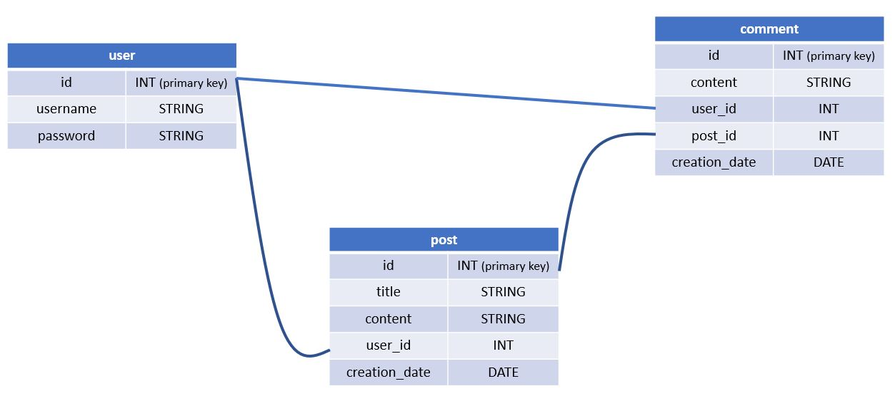

 * El esquema está conformado por tres tablas que pertenecen a la base de datos "techblog_db".
 * La creación de la base de datos puede hacerse usando el archivo "schema.sql" ubicado en la carpeta "/db".
 * Igualmente, al ejecutar el comando "node seeds/index.js " desde la terminal de node.js (estando en la carpeta principal/raíz), se pueden crear algunos registros iniciales en las tablas de la base de datos.

## Instrucciones de instalación  

* Esta aplicación requiere de:
    * Instalación de node JS versión 16.18.0
    * Instalación del paquete express 4.17.1
    * Instalación del paquete sequelize 6.3.5
    * Instalación del paquete npm mysql2 2.2.5
    * Instalación del paquete npm dotenv 8.2.0
    * Instalación del paquete npm bcrypt 5.0.0
    * Instalación del paquete npm connect-session-sequelize 7.0.4
    * Instalación del paquete npm express-handlebars 5.2.0
    * Instalación del paquete npm express-session 1.17.1
    * Instalación del paquete npm handlebars 4.7.6

## Instrucciones para realizar pruebas 

* Emplea el archivo "schema.sql" ubicado en la carpeta "/db" para crear la base de datos. Para ello puedes utilizar MySQL shell directamente, tal como se muestra en la siguiente imagen.  
  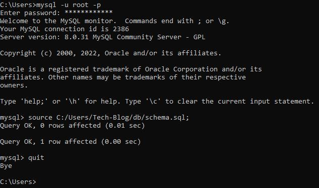  
* Es necesario crear un archivo de variable de entorno ".env" en la carpeta principal/raíz de la aplicación, donde coloques el nombre de la base de datos (utilizando la variable "DB_NAME"), el nombre de usuario MySQL (utilizando la variable "DB_USER") y la contraseña necesaria (utilizando la variable "DB_PASS") para acceder a la base de datos.  
* La ejecución de la aplicación se tiene que hacer desde la terminal de node.js  
* Asegúrate de estar en la ubicación de la carpeta principal/raíz de la aplicación: TECH-BLOG\    
  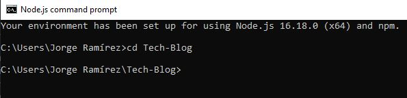  
* Para crear algunos registros iniciales en las tablas de la base de datos, puedes ejecutar el comando "node seeds/index.js"  
  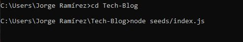  
* Para iniciar el servidor y poder utilizar la aplicación así como sus rutas, emplea el comando "npm start" desde la terminal de node.js      
  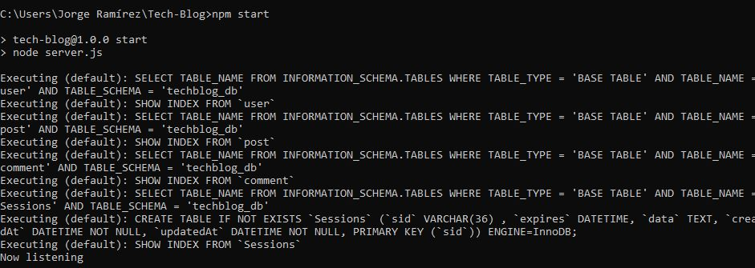  

## Información de uso de la aplicación

* Para entrar a la aplicación accede al siguiente link:   
* Para visualizar todas las publicaciones del blog, da clic en el enlace de "Home".  
  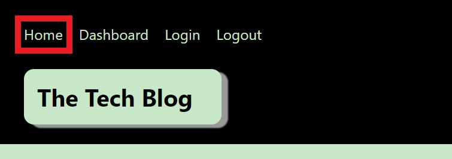
* Para visualizar los comentarios de cierta publicación, da clic sobre la publicación de interés.  
  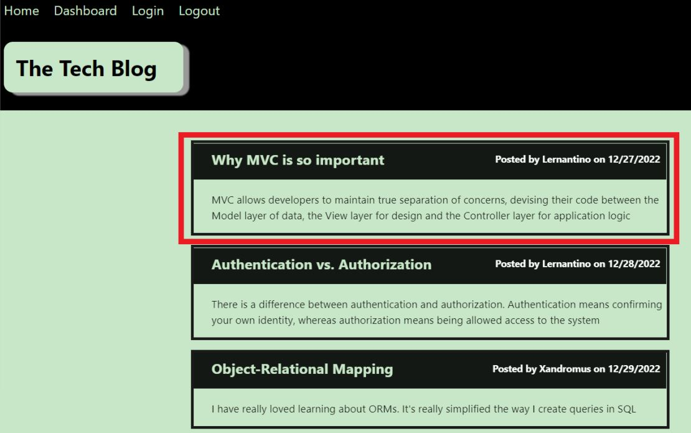
  * Entonces verás los comentatios para dicha publicación:  
    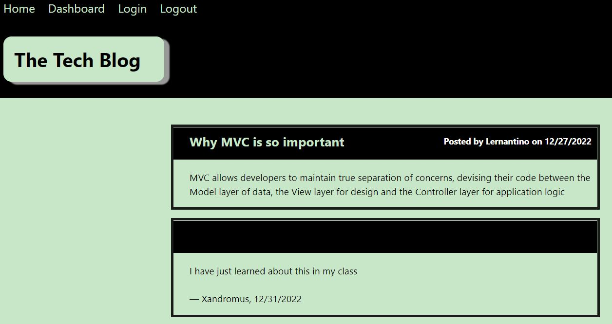
* Si deseas visualizar la sección de "Dashboard", crear comentarios y/o crear, modificar y borrar publicaciones, entonces da clic en el enlace de "Login" para iniciar sesión o registrarte.
   
* Para iniciar sesión:  
  1. Introduce tus credenciales (usuario y contraseña) y da clic en el botón de "Login".  
    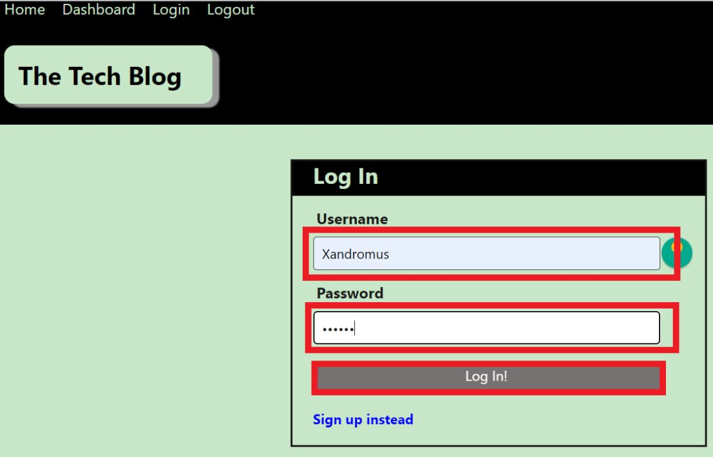
  2. Si tus credenciales fueron correctas, verás tu "Dashboard" con las publicaciones que has creado.  
    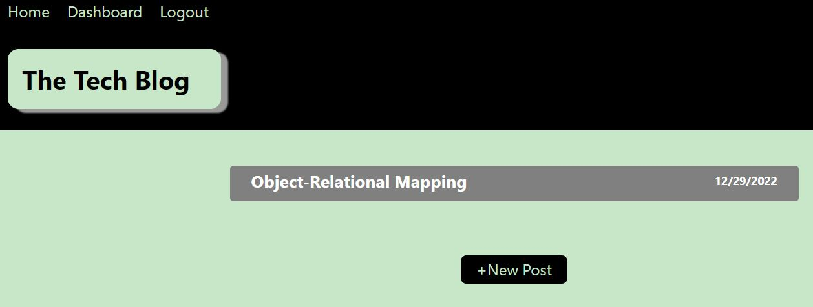 
* En cambio, si deseas registrarte:  
  1. Da clic en el enlace "Sign up".  
    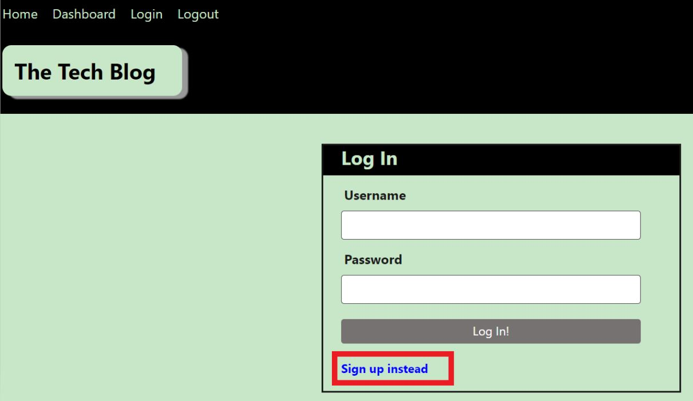     
  2. Luego introduce tu usuario y la contraseña que deseas utilizar y da clic en "Sign Up".     
    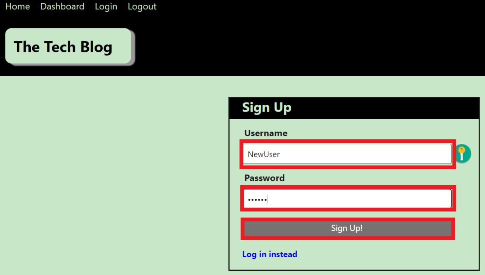 
  3. Si tus credenciales se guardaron correctamente, verás tu "Dashboard" vacío.  
    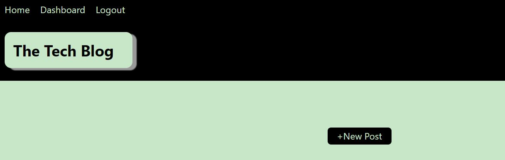  
* Para crear comentarios:  
  1. Da clic en el enlace de "Home".  
     
  2. Da clic sobre la publicación a la cual deseas agregarle un comentario.  
      
  3. Introduce el comentario que deseas publicar y da clic en el botón "Submit".  
    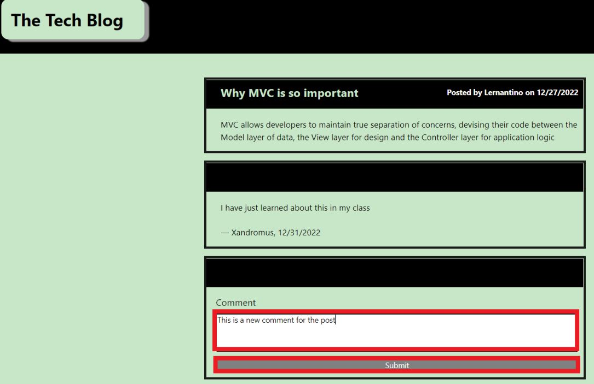 
  4. Verás el nuevo comentario creado debajo de la publicación con tu usuario y la fecha de creación.  
    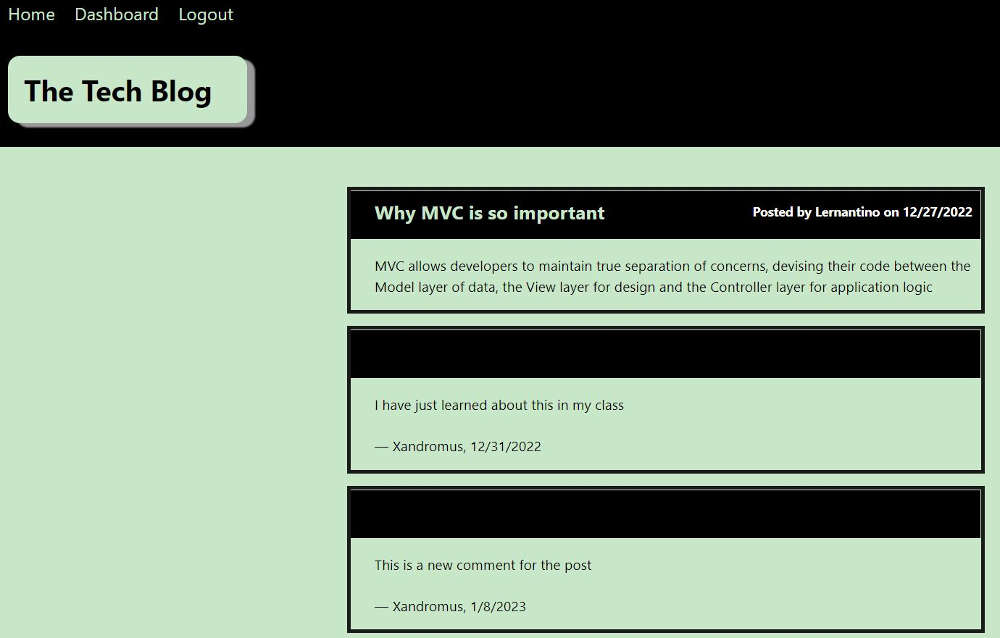 
* Para crear publicaciones:  
  1. Da clic en el enlace de "Dashboard".       
    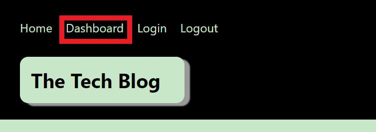  
  2. Presiona el botón "+New Post".    
    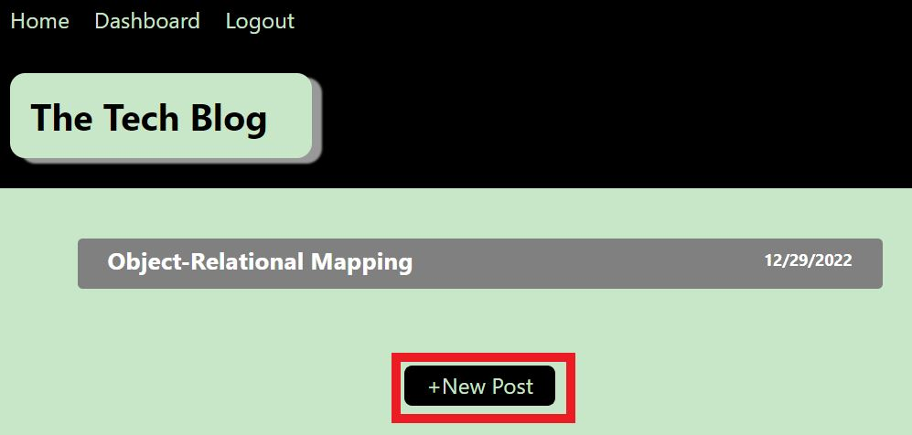
  3. Introduce el título y contenido de la publicación y da clic en el botón "Create".  
    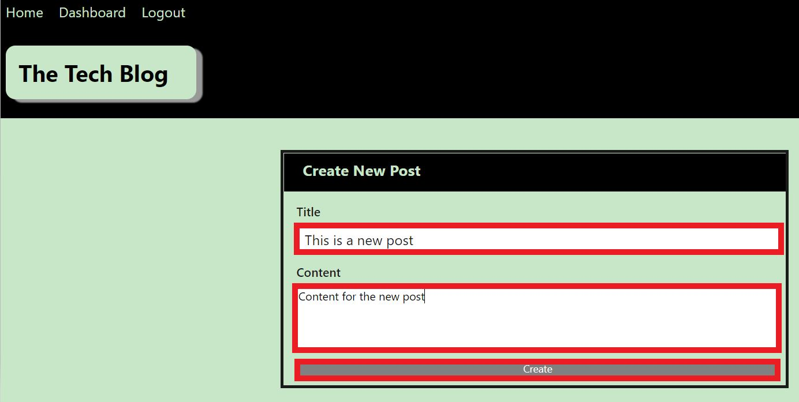  
  4. La aplicación te regresará a tu "Dashboard" donde verás la nueva publicación creada con su título y fecha de creación.    
    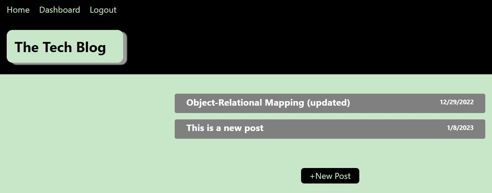
* Para modificar tus publicaciones:  
  1. Da clic en el enlace de "Dashboard".  
    
  2. Da clic sobre la publicación que deseas modificar.  
    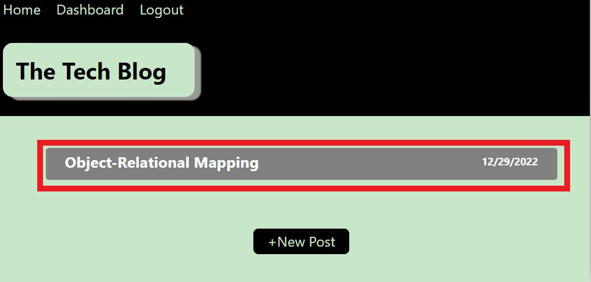
  3. Introduce el nuevo título y/o contenido de la publicación y da clic en el botón "Update".    
    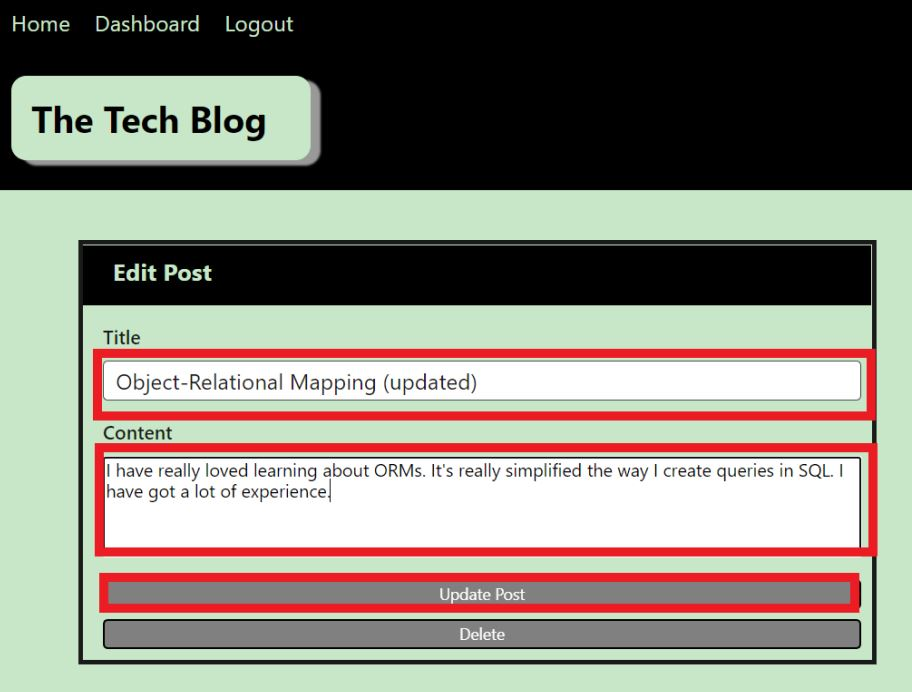
  4. La aplicación te regresará a tu "Dashboard" ya con la publicación actualizada.  
    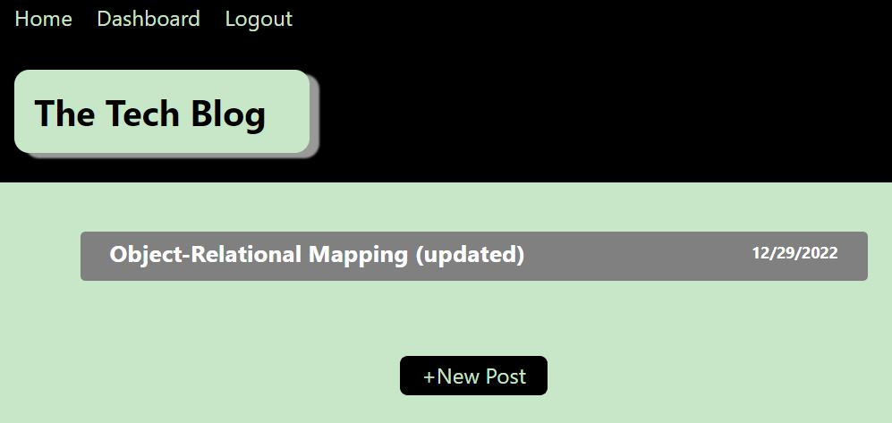
* Para eliminar tus publicaciones:   
  1. Da clic en el enlace de "Dashboard".    
     
  2. Da clic sobre la publicación que deseas eliminar.      
    
  3. Da clic en el botón "Delete".  
    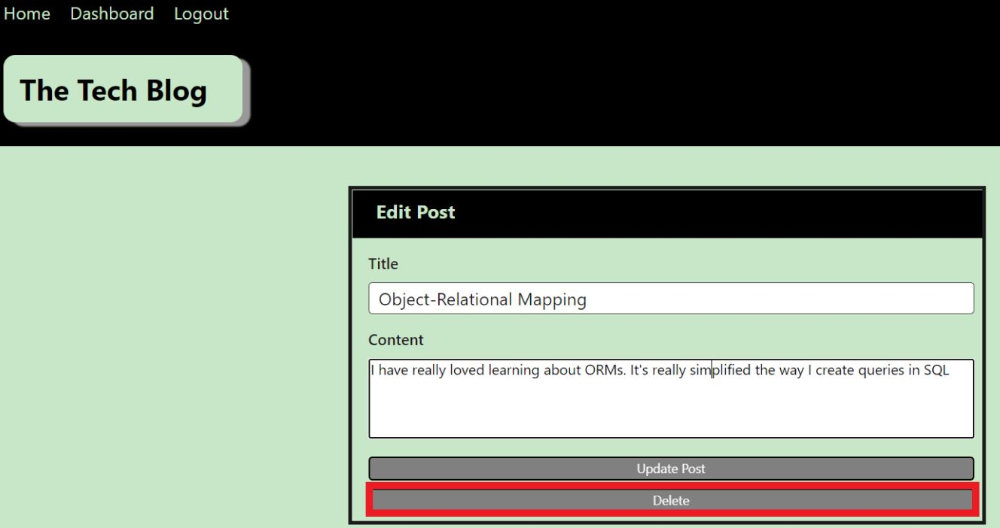
  4. La aplicación te regresará a tu "Dashboard" donde ya no verás la publicación eliminada.  
    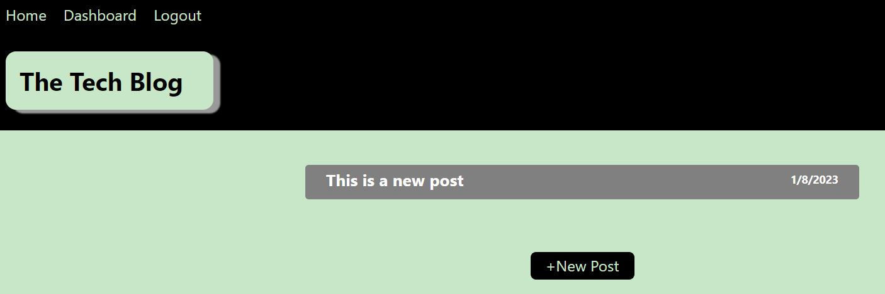 
* Para cerrar sesión, presiona el enlace de "Logout".  
    

## Animación de funcionalidad de la aplicación

* 

